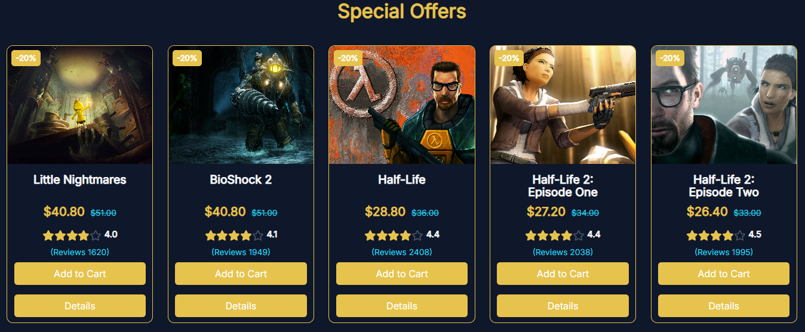
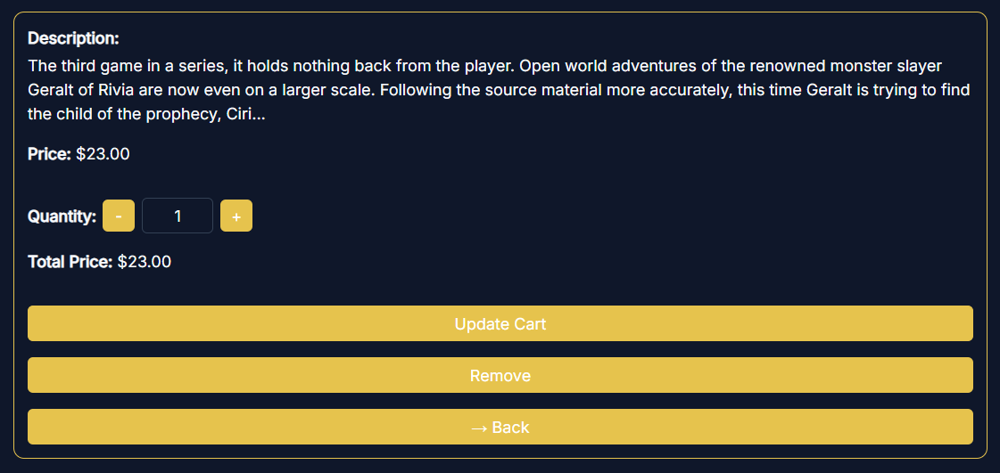
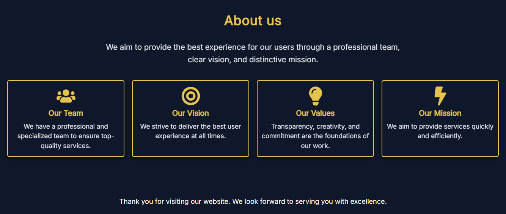
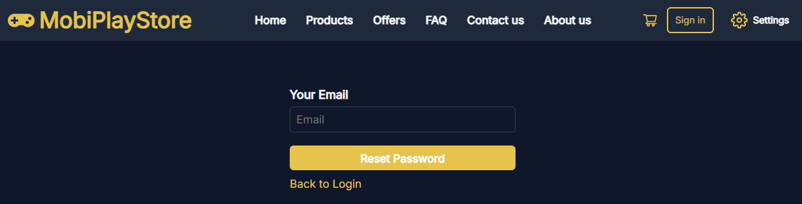

# 🎮 MobiPlayStore – Full-Stack Mobile Game Cards Web App
💼 Personal Project | June 2025

**MobiPlayStore** is a full-stack bilingual web application (Arabic / English) for purchasing mobile game top-up cards.  
The project is built using a modern and scalable architecture with a strong focus on performance, accessibility, and user experience.

The application includes user authentication, profile management, and a Redux-managed user-specific shopping cart. Advanced features include multi-theme support, Google Maps integration, a secure payment system, and a fully responsive modern UI.

---

## 🚀 Live Demo

🌐 **[Live Demo](https://mobiplaystore-syr.web.app/)**

---

## 🔧 Tech Stack

- ⚛️ React  
- 🗂️ Redux Toolkit, React Context API  
- 🔄 React Router  
- 🎨 Bootstrap 5, CSS3  
- 🔌 React Select  
- 🌐 i18next (Arabic / English + RTL)  
- 📝 Google Fonts (Inter, Cairo) with font toggle  
- 💾 localStorage (language, font, theme persistence)  
- ☁️ Firebase Hosting  
- 🟢 Node.js, Express.js  
- 📍 Google Maps API  

---

## 🌟 Features

- 🛒 User-specific shopping cart managed with Redux and localStorage persistence  
- 🔑 User authentication and profile management  
- ⭐ Product rating and review system  
- 🌙 Advanced multi-theme support (Light, Dark, Reading, Colorblind-friendly modes)
- 🌍 Bilingual support (Arabic / English) with full RTL handling  
- 📱 Fully responsive design (mobile & desktop)  
- 🔄 Smooth navigation using React Router  
- ⚛️ State management via Redux Toolkit and React Context API  
- 📍 Google Maps integration for location-based features  
- 💳 Secure payment system  

---

## 📸 Screenshots – Dark Mode

| 🏠 Home |
|----------|
|     |

| 🖤 Footer |
|-----------|
|  |

| 🛍️ Products |
|-------------|
|  |

| 🎁 Offers |
|-----------|
|  |

| 🌟 Product Details |
|------------------|
|     |

| 🛒 Cart |
|---------|
|  |

| 💳 Checkout |
|-------------|
|  |

| 📝 Contact Us |
|------------|
|  |

| ℹ️ About Us |
|------------|
|  |

| 🔑 Sign In / Login |
|-------------------|
|  |

| 🆕 Register / Create Account |
|----------------------------|
|  |

| 🔄 Reset Password |
|-----------------|
|  |

| 👤 Profile |
|-----------|
|  |

| ⚙️ Settings |
|------------|
|  |

## 📂 Repository

Full source code and project files are available here:

👉 [MobiPlayStore — GitHub Repository](https://github.com/mohammed-salloum/MobiPlayStore)

---

## 👨‍💻 Author

**Mohammed Salloum**  
Front-End React Developer  

📧 Email: mohammed.e.salloum@gmail.com  
🔗 LinkedIn: https://linkedin.com/in/mohammed-salloum-dev
