# 🎮 MobiPlayStore – Mobile Game Cards Store Web Application

### 💼 Personal Project | June 2025

MobiPlayStore is a full-featured responsive web application for selling mobile game top-up cards.  
Developed using React, Redux Toolkit, React Router, Context API, React Select, Bootstrap 5, and CSS3, the application provides a smooth user experience across all devices.  
It also includes advanced features such as shopping cart management, a product rating system, dark/light mode toggle, multi-language support (Arabic/English), and a font style switcher for enhanced readability and usability.

---

## 🚀 Live Demo  
[🌐 View Project Online](https://mobiplaystore-syr.web.app/)

---
## 🔧 Tech Stack

- ⚛️ React  
- 🗂️ Redux Toolkit, React Context API  
- 🔄 React Router  
- 🎨 Bootstrap 5, CSS3  
- 🔌 React Select  
- 💾 localStorage for state persistence

---

  ## 🌟 Features

- 🛒 Shopping cart management with localStorage persistence  
- ⭐ Product rating and review system  
- 🌙 Dark and Light mode toggle with seamless UI  
- 🌍 Multi-language support (**Arabic / English**)  
- 🔤 Font style switcher for better readability  
- 📱 Fully responsive design for mobile and desktop  
- 🔄 Smooth navigation using React Router  
- ⚛️ State management via Redux Toolkit and React Context API  

---

## 📸 Screenshots  

| 🏠 Home – Light | 🏠 Home – Dark |
|-----------------|----------------|
| 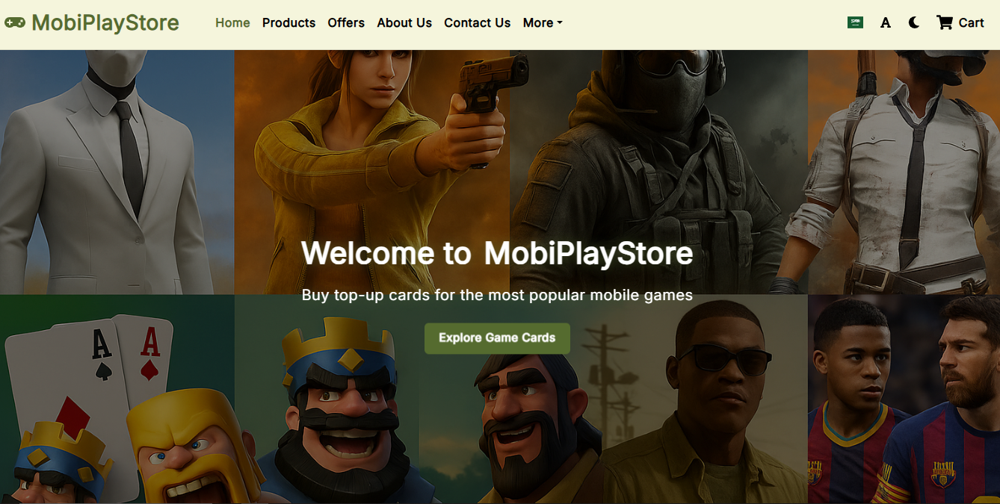   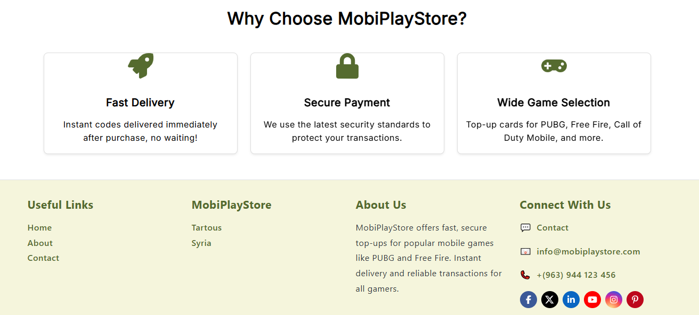 | 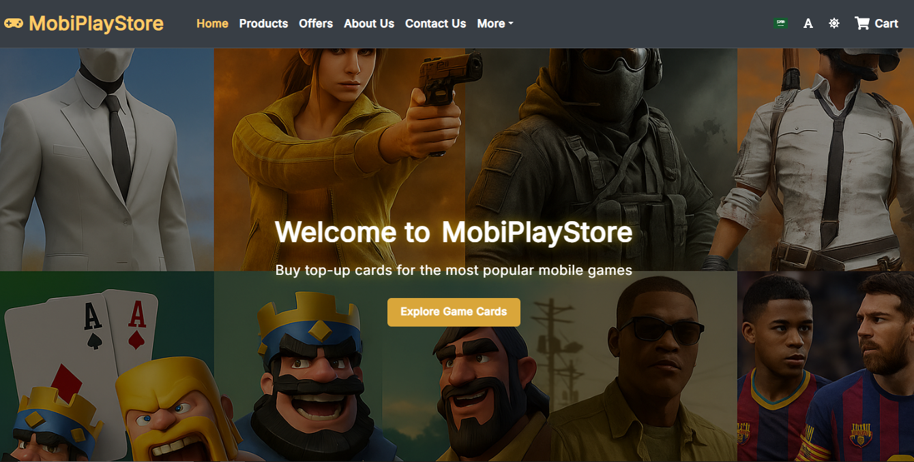   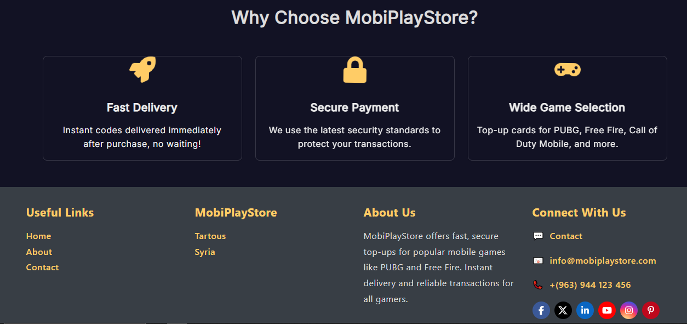 |

| 🛍️ Products – Light | 🛍️ Products – Dark |
|---------------------|---------------------|
| 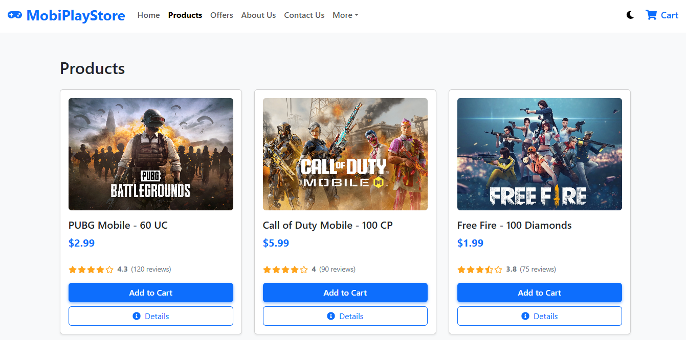 | 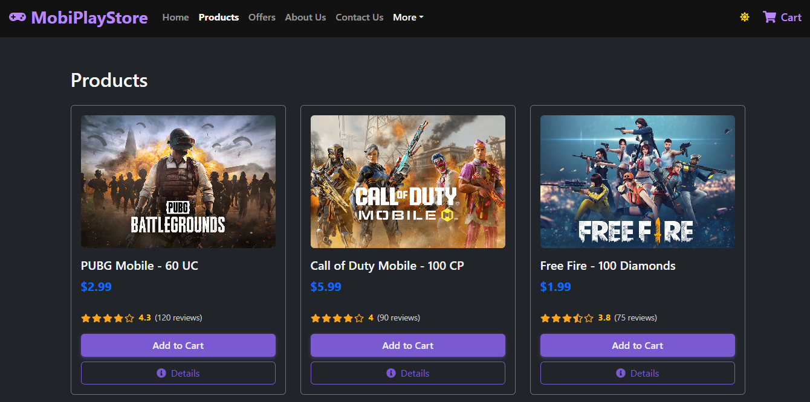 |

| 🌟 Product Details – Light | 🌟 Product Details – Dark |
|----------------------------|---------------------------|
| 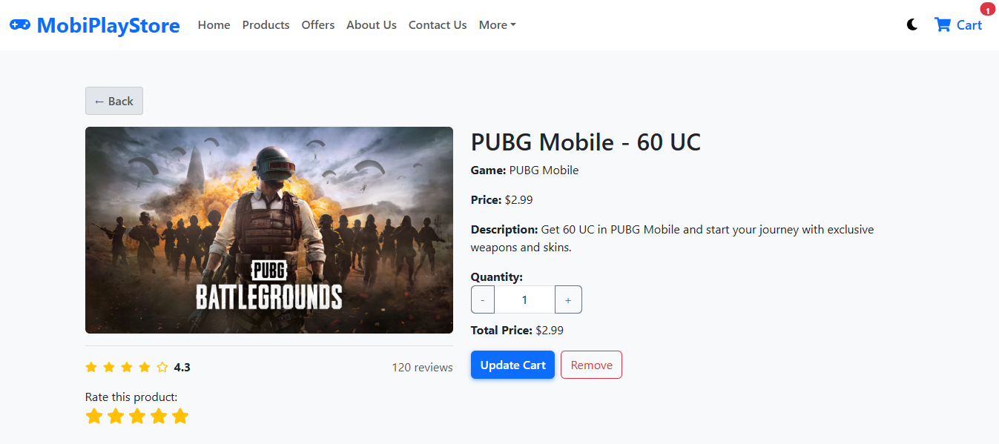 | 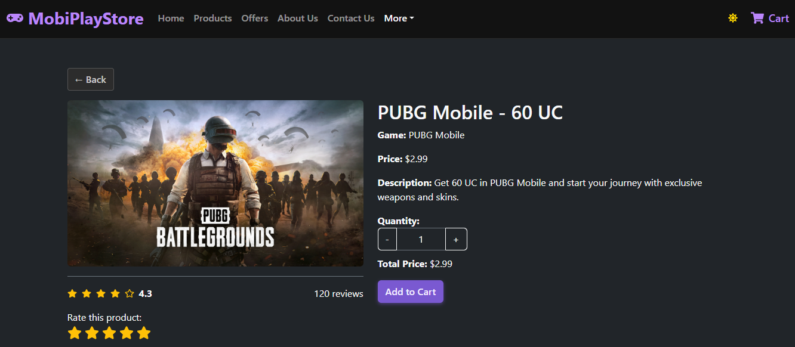 |

| 🎁 Offers – Light | 🎁 Offers – Dark |
|------------------|------------------|
| 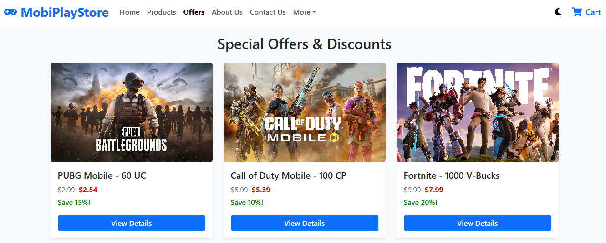 | 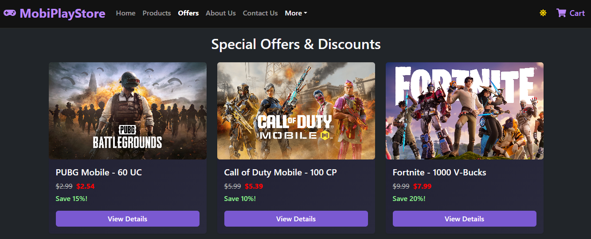 |

| 🛒 Cart – Light | 🛒 Cart – Dark |
|----------------|----------------|
| 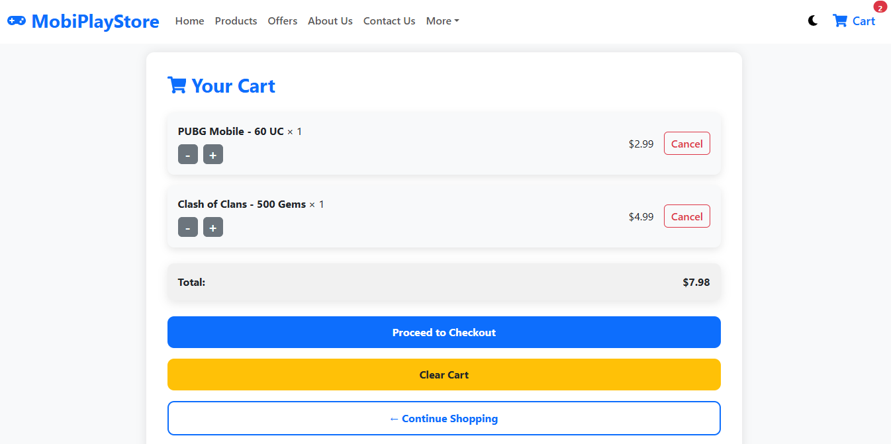 |  |

| 💳 Checkout – Light | 💳 Checkout – Dark |
|---------------------|---------------------|
| 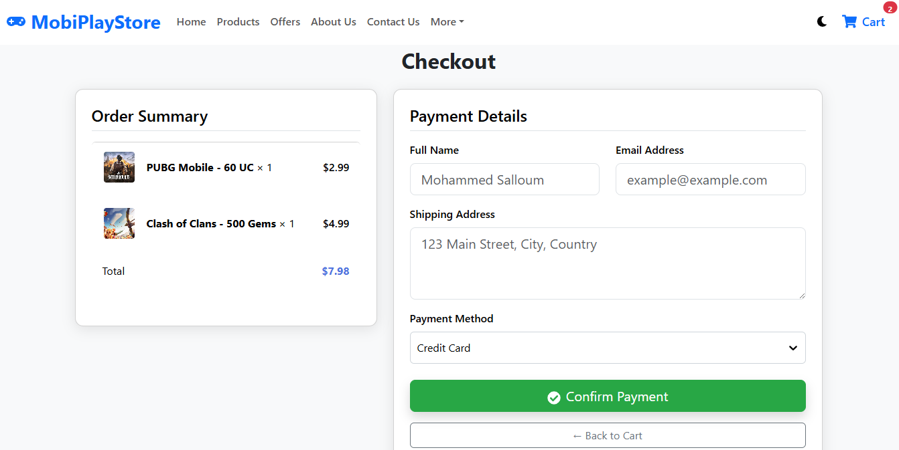 | 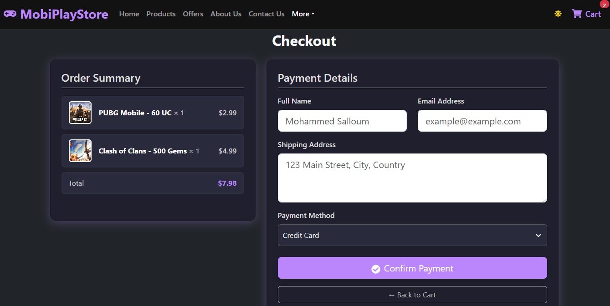 |

| 📝 Contact – Light | 📝 Contact – Dark |
|-------------------|-------------------|
| 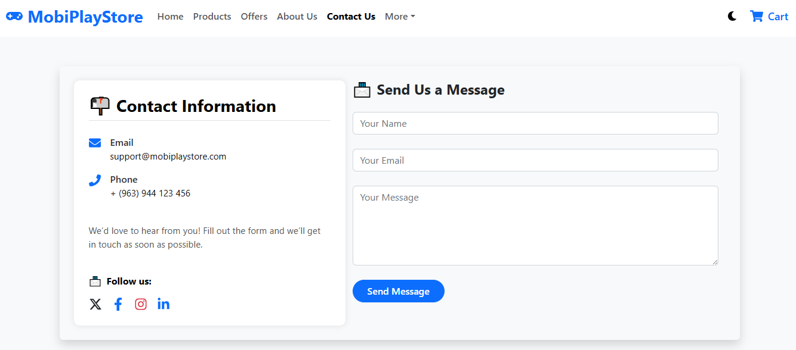 | 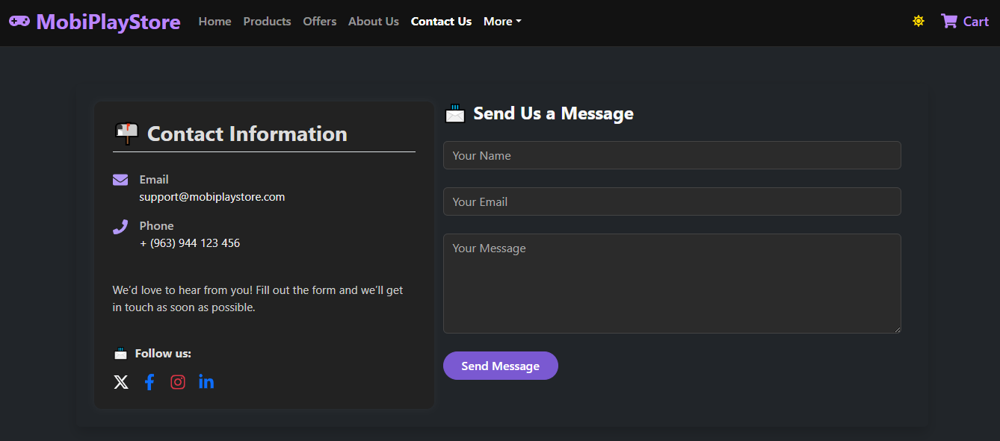 |

---

## 📂 Repository

Full source code and project files available here:

[🔗 MobiPlayStore — GitHub Repository](https://github.com/mohammed-salloum/MobiPlayStore)

---

## 👨‍💻 Author

**Mohammed Salloum**  
Full-Stack Web Developer | Django & React Specialist  
📧 mohammed.e.salloum@gmail.com  
🔗 [LinkedIn – mohammed-salloum-dev](https://linkedin.com/in/mohammed-salloum-dev)
