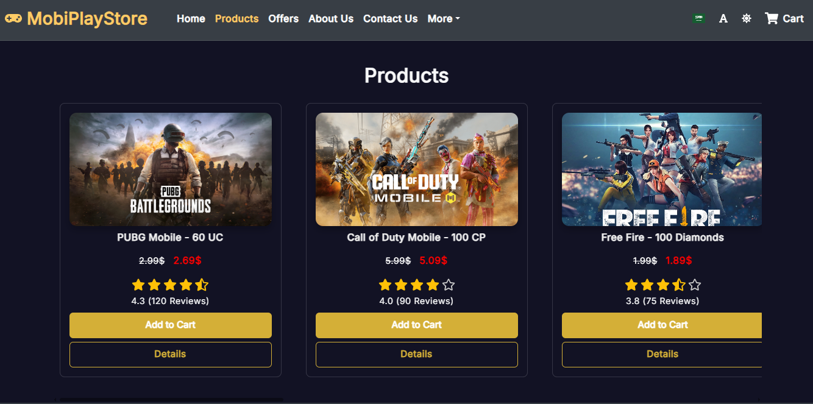
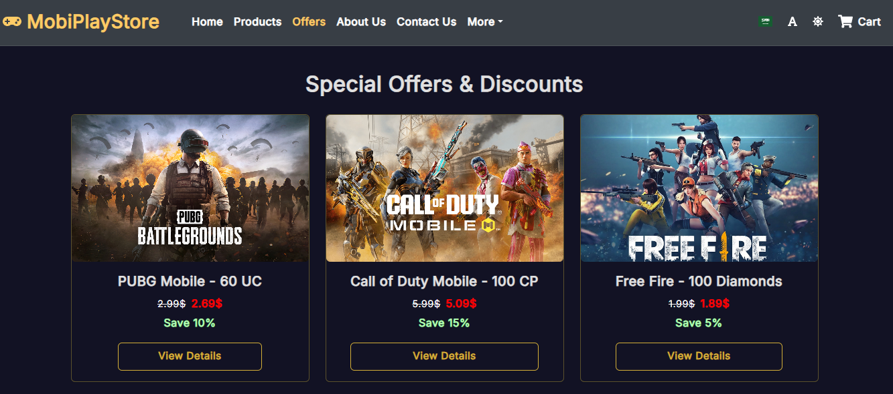

# 🎮 MobiPlayStore – Mobile Game Cards Store Web Application
💼 Personal Project | June 2025

MobiPlayStore – Full-Stack Web Application

Full-stack bilingual web application (Arabic/English) for purchasing mobile game top-up cards. Developed using React, Redux Toolkit, React Router, Context API, React Select, i18next, Bootstrap 5, CSS3, Node.js, Express.js, Firebase Hosting, and Google Maps API. The application includes user authentication, profile management, and a Redux-managed user-specific shopping cart. Advanced features include multi-theme support, Google Maps integration, a secure payment system, and a fully responsive modern UI.

🚀 Live Demo & GitHub

🌐 Live Demo | 🐙 GitHub: MobiPlayStore

🔧 Tech Stack

⚛️ React

🗂️ Redux Toolkit, React Context API

🔄 React Router

🎨 Bootstrap 5, CSS3

🔌 React Select

🌐 i18next (Arabic/English + RTL)

📝 Google Fonts (Inter, Cairo) with font toggle

💾 localStorage for preferences persistence (language, font, theme)

☁️ Firebase Hosting

🟢 Node.js, Express.js

📍 Google Maps API

🌟 Features

🛒 User-specific shopping cart managed with Redux and localStorage persistence

🔑 User authentication and profile management

⭐ Product rating and review system

🌙 Multi-theme support (Dark/Light mode) with seamless UI

🌍 Bilingual support (Arabic / English) with RTL

📱 Fully responsive design for mobile and desktop

🔄 Smooth navigation using React Router

⚛️ State management via Redux Toolkit and React Context API

📍 Google Maps integration for location-based features

💳 Secure payment system

## 📸 Screenshots  

| 🏠 Home – Dark |
|-----------------|
|     |

| 🖤 Footer |
|-------------------|
|  |

| 🛍️ Products – Dark |
|---------------------|
|  |

| 🎁 Offers – Dark |
|------------------|
|  |

| 🌟 Product Details – Dark |
|---------------------------|
|     |

| 🛒 Cart – Dark |
|----------------|
|  |

| 💳 Checkout – Dark |
|---------------------|
|  |

| 📝 Contact – Dark |
|-------------------|
|  |

---

## 📂 Repository

Full source code and project files available here:

[🔗 MobiPlayStore — GitHub Repository](https://github.com/mohammed-salloum/MobiPlayStore)

---

## 👨‍💻 Author

**Mohammed Salloum**  
Front-End React Developer  
📧 mohammed.e.salloum@gmail.com  
🔗 [LinkedIn – mohammed-salloum-dev](https://linkedin.com/in/mohammed-salloum-dev)
